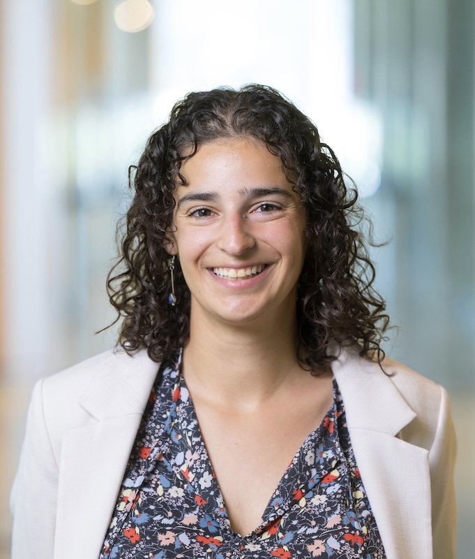

::: {.grid}
::: {.g-col-12 .g-col-md-8}
::: {.hero}
::: {.hero-title}
Hi, I'm Rebecca.
:::

::: {.hero-subtitle}
I'm a data scientist with 5+ years of experience managing end-to-end analysis projects and turning messy, unstructured data into scalable data systems. I work across Python, R, and SQL to build reproducible pipelines, automate reporting, and communicate findings for diverse audiences. Currently pursuing a Master of Data Science at the University of British Columbia with a focus on applied machine learning and statistical analysis. I'm drawn to mission-driven organizations making an impact on people's lives, not just the bottom line.
:::

[View my projects →](projects/index.qmd){.btn .btn-primary style="margin-top: 1.5rem;"}
[About me](about.qmd){.btn .btn-outline-secondary style="margin-top: 1.5rem; margin-left: 0.5rem;"}
:::
:::
::: {.g-col-12 .g-col-md-4 style="display: flex; align-items: center; justify-content: center;"}
{style="border-radius: 80%; width: 90%; max-width: 600px;"}
:::
:::