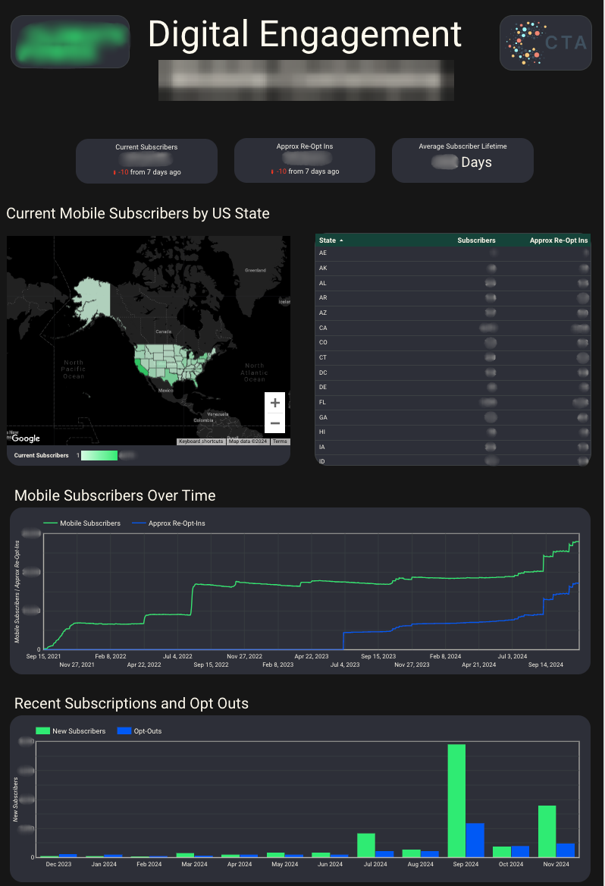

## Context

A climate organizing nonprofit approached CTA with a big ask. They wanted a comprehensive view of their digital presence across email, sms, and social media. Their staff were each experts in their own domain but when it came to having a holistic view and being able to report back to senior organizational leadership, they were having to spend time coordinating to answer simple questions.

## The Data

Their digital work happened across 5 key platforms: Google Analytics on multiple websites, a social media management tool covering their presence on Facebook, Instagram, Twitter, and TikTok, email via Action Network, text via Mobile Commons, and another platform managing shareable action toolkits. I took a lead role coordinating with our engineering team to build data ingestion pipelines for each of their tools, bringing their data together reliably in one centralized database. Next, another analyst and I split the sources to develop full dashboard pages for each of their priority platforms in the same dashboard. 

Using SQL mirror connections for both their email and text platforms, I set to pulling out the key metrics and data fields needed to track subscribers over time and the particular messages that most drove engagement. One thing that was difficult in this work was that they had been using the same email tool for years, meaning they had a large volume of data. In particular their platform tracked each send, open, click, and reply as actions in the same table. When the table reached a certain size, they simply added another table: `email_activities_1`, `email_activities_2`, etc. This was both a challenge for our engineers and myself ensuring that the complete pipeline, from ingestion to analysis, was robust enough to handle the new tables when they were created. 

For my first attempt, I wrote a complicated query with many `UNION ALL` statements combining each table with a Cloud Logging notification for myself to update the query when a new table appeared in the dataset. This solution worked but would require ongoing maintenance from either myself or a future analyst. As a second iteration, I looked to take advantage of the consistent table naming through wildcard syntax. Luckily, the way that our sync worked, each table was truly a table rather than a view or materialized view. As such, I was able to write a fairly simple query that was reliable and would stand the test of time:

```
WITH activities AS (
  SELECT *
  FROM `<bigquery_project_id>.<dataset>.email_activities_*`
)
SELECT ...
```

## The Dashboard

The other CTA analyst on this project and I built a multi-page dashboard to give the organizations team a single place where they could go to access information across all their tools. The homepage provided priority KPIs for each platform followed by individual dashboard pages for each platform to dig deeper into engagement through each. We ensured consistent style across the dashboard and used the same visualization types for similar metrics for each platform. Below is a screenshot of one of the dashboard pages that I owned.

{.blurred-screenshot}
## The Impact

Because of the clear documentation and iterative development approach that we took to this dashboard, once it was complete we were able to completely hand off the product to the organization's team without need for ongoing maintenance and monitoring. The dashboard proved especially helpful to the organizations team as they ran several voter contact campaigns for the 2024 elections.

## Reflection

This was one of the more complex engagements I worked on at CTA. With data ingestion from 5 different platforms, several of which were new for our engineering team, plus close collaboration with another analyst, keeping everything consistent required more coordination than a typical solo project. Because the organization wanted both a deeper understanding of each platform specifically as well as the overall view of their program, we were able to begin analysis for the dashboard of data from some platforms before the pipelines for others had been completed. As  I noted earlier, the other analyst and I were able to split the work so each of us led the analysis for different platforms. We were then able to offer each other regular feedback and reviews to make sure things were cohesive between code and visualization styles.

---

**Tools**: Google BigQuery · SQL · Looker Studio · Google Analytics · Action Network · MobileCommons · Sprout Social