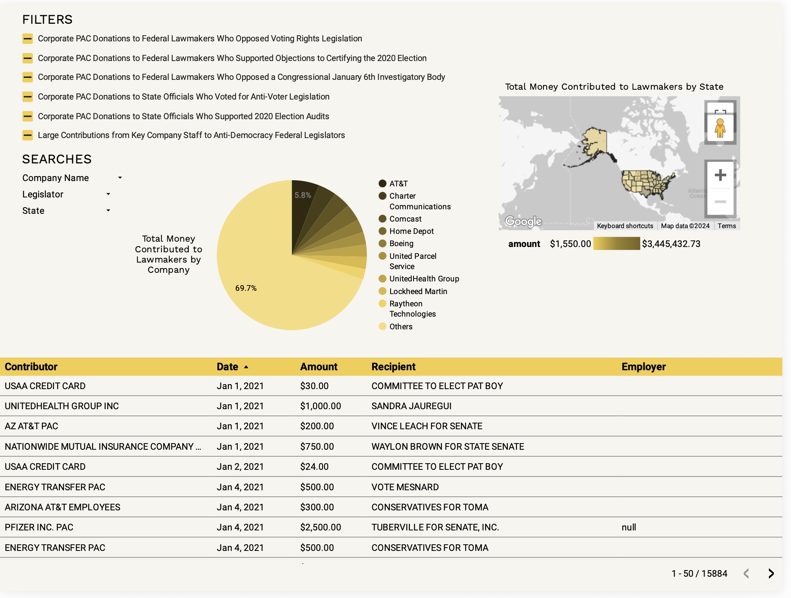

## Context

At Community Tech Alliance, I developed a dashboard for a government accountability organization tracking donations to politicians, which uncovered patterns between large corporate donations and votes on specific categories of legislation. In total, I tracked thousands of donations across all 50 states.

## The Data

I integrated political contributions and votes data from the FEC, state financial reports, corporate shareholder information and recorded legislative votes. With data coming from disparate sources, I started with significant cleaning and standardization. Then, using complex SQL queries, I created a stable dashboard table to track the connections between these large donations and the vote outcomes. 

## The Dashboard

I deliberately kept the dashboard simple: 1 page with the ability to filter donations by company, politician and votes. Given the importance of this topic, clarity and credibility mattered more than visual complexity. I additionally included a map to show where these donations had the most impact. Here's a blurred screenshot to avoid showing any proprietary data but keeping the layout visible.

{.blurred-screenshot}

## The Impact

Using the dashboard as a resource, the partner organization published a scorecard holding Fortune 500 companies accountable for their political donations. The resulting scorecard was shared with journalists and advocacy groups to increase public awareness of these companies.

---

**Tools**: Google BigQuery · SQL · Looker Studio  
