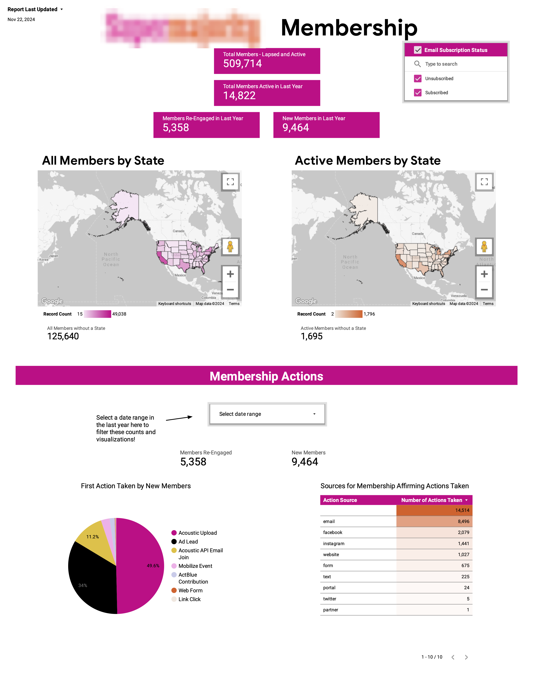

## The Context

A national women's advocacy organization came to Community Tech Alliance with a problem. Their digital team was spending hours each week pulling lists of their members from some platforms and uploading them into others. They didn't have a single holistic view of their membership, that they could use to actually analyze the data and make decisions about program performance. 

## The Data

The journey to a comprehensive membership report started with gathering input from the entire team to understand the full scope of their tools and data sources. For each source, I helped them determine which metrics and actions actually defined what made an individual a member of their organization. From there, I coordinated with the CTA engineering team to build custom ingestion pipelines for 4 priority platforms, ensuring all of their key data landed in the same place.

For platforms that didn't warrant a full pipeline, I set up a Google Workflows automation to ingest additional flat files from a shared Google Drive folder, allowing the team to upload exports directly without engineering involvement. This kept the membership data comprehensive without creating ongoing maintenance burden.

This is where the real data standardization challenge began. I started by merging together the lists of members coming from each data source. I chose email as the primary key since it was the only consistent identifier present across all platforms and used many `coalesce` functions to bring together each member's info across platforms. 

```
TABLE members
─────────────────────────────────────────────────────────────────────
email           VARCHAR     Primary Key
first_name      VARCHAR     
last_name       VARCHAR     
phone           VARCHAR     
zip_code        VARCHAR     
state           VARCHAR
─────────────────────────────────────────────────────────────────────
```

Next, I standardized the membership actions from each platform into a consistent format:

```
TABLE actions
─────────────────────────────────────────────────────────────────────
email           VARCHAR     FK → members.email
action_date     DATE        Date of member action
source          VARCHAR     Platform where action occurred
action_name     VARCHAR     Specific action that was taken
medium          VARCHAR     UTM source code or similar of the action
─────────────────────────────────────────────────────────────────────
```

Finally, I brought the two tables together into a materialized view to power the dashboard itself. I extracted each member's first and latest action to get reliable join and renewal dates. With fully integrated data on hand, I was ready to design a Membership Dashboard that our partner organization's team could use to understand their membership and make data-driven decisions about their organizing campaigns.


## The Dashboard

Since the most pressing need for the organization's team was having easy access to the true counts of their members, I put these metrics front and center, including both active and inactive members as well as maps showing their geographic distribution. Next I included visualizations and tables showing important information about the membership actions (eg: which actions are most popular, which actions are typically a members' first, etc)

{.blurred-screenshot}

## The Impact and Dashboard Improvements

Once the dashboard went live for the partner organization's team, the amount of time saved for their digital team was immediately apparent; the team lead said that the dashboard saved them hours of manual work each week. They were able to instead spend their time crafting innovative messaging and designing more effective campaigns. We soon added a note in the corner of the dashboard indicating the date of last refresh of the materialized view allowing viewers to know exactly how fresh the dashboard was.


---

**Tools**: Google BigQuery · SQL · Looker Studio · Google Workflows
